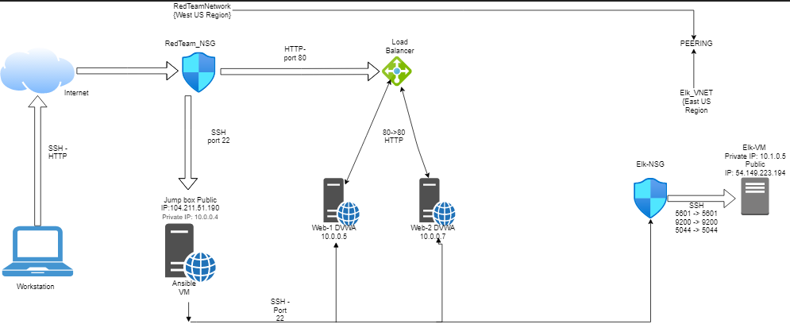

## Automated ELK Stack Deployment

The files in this repository were used to configure the network depicted below.

These files have been tested and used to generate a live ELK deployment on Azure. They can be used to either recreate the entire deployment pictured above. Alternatively, select portions of the _____ file may be used to install only certain pieces of it, such as Filebeat.

  - [ELK Install](https://github.com/tolulope-ops/cybersecurity-projects/blob/main/ansibles/elk.yml)
  - [Metricbeat Playbook](https://github.com/tolulope-ops/cybersecurity-projects/blob/main/ansibles/metricbeat.yml-playbook.yml)
  - [Filebeat Playbook](https://github.com/tolulope-ops/cybersecurity-projects/blob/main/ansibles/filebeat.yml)

This document contains the following details:
- Description of the Topologu
- Access Policies
- ELK Configuration
  - Beats in Use
  - Machines Being Monitored
- How to Use the Ansible Build

### Description of the Topology

The main purpose of this network is to expose a load-balanced and monitored instance of DVWA, the D*mn Vulnerable Web Application.

Load balancing ensures that the application will be highly avaiable, in addition to restricting access to the network.
Load balancers help ensure environment avalability through distribution of incoming data to web servers.
Jump box allows for more easy administration of multiple systems and provide and additional layer between the outside and internal assets.

Integrating an ELK server allows users to easily monitor the vulnerable VMs for changes to the event Logs and system metrics
Filebeat watch for logs directories or specific log files 
Metricbeat record help monitor servers by collecting metrics from the system and services running on the servers

The configuration details of each machine may be found below.
_Note: Use the [Markdown Table Generator](http://www.tablesgenerator.com/markdown_tables) to add/remove values from the table_.

| Name       | Function    | IP Address | Operating System |
|------------|-------------|------------|------------------|
| Jump box   | Gateway     | 10.0.0.4   |       Linux      |
| Web-1      | DVWA server | 10.0.0.5   |       Linux      |
| Web-3      | DVWA server | 10.0.0.7   |       Linux      |
| ELK server | Log server  | 10.1.0.5   |       Linux      |

### Access Policies

The machines on the internal network are not exposed to the public Internet. 

Only the Jump box machine can accept connections from the Internet. Access to this machine is only allowed from the following IP addresses:
Personal IP addresses_

Machines within the network can only be accessed by Jump box.
The ELK machine allow to access from personal IP address through port 5601.

A summary of the access policies in place can be found in the table below.
| Name          | Publicly Accessible | Allowed IP Address |
|---------------|---------------------|--------------------|
| Jumpbox       |         Yes         | 104.211.51.190     |
| Load Balancer |          No         | Open               |
| Web -1        |          No         | 10.0.0.5           |
| Web -3        |          No         | 10.0.0.7           |
| Elk Server    |         Yes         | 99.227.98.133      |

### Elk Configuration

Ansible was used to automate configuration of the ELK machine. No configuration was performed manually, which is advantageous because,
services running can be limited ,system installation and update can be streamlined, and processed more replicable.

The following implement the task: 
install docker.io,pip3, and the docker module.
[elk playbook File](https://github.com/tolulope-ops/cybersecurity-projects/blob/main/ansibles/elk.yml)

     
 Target machines and Beats
 The ELK server configured to monitor the folowing machines 
 web-1 (10.0.0.5)
 web-3 (10.0.0.7)

The playbook implements the following tasks:
-  In 3-5 bullets, explain the steps of the ELK installation play. E.g., install Docker; download image; etc._
- ...
- ...

The following screenshot displays the result of running `docker ps` after successfully configuring the ELK instance.

[Docker output](https://github.com/tolulope-ops/cybersecurity-projects/blob/main/diagrams/ELKserver.png)

### Target Machines & Beats
This ELK server is configured to monitor the following machines:
- _TODO: List the IP addresses of the machines you are monitoring_

We have installed the following Beats on these machines:
- _TODO: Specify which Beats you successfully installed_

These Beats allow us to collect the following information from each machine:
- _TODO: In 1-2 sentences, explain what kind of data each beat collects, and provide 1 example of what you expect to see. E.g., `Winlogbeat` collects Windows logs, which we use to track user logon events, etc._

### Using the Playbook
In order to use the playbook, you will need to have an Ansible control node already configured. Assuming you have such a control node provisioned: 

SSH into the control node and follow the steps below:
- Copy the configuration file from the ansible container to web VMs.
- Update the /etc/ansible/host file to include the IP address of the ELK server VM and webservers
- Run the playbook, and navigate to http://[ELK _VM_Public IP]:5601 to check that the installation worked as expected.

_TODO: Answer the following questions to fill in the blanks:_
- _Which file is the playbook?
   The Filebeat-Configuration 
 Where do you copy it?
 copy /etc/ansible/files/filebeat-config.yml to /etc/filebeat/filebeat.yml

- _Which file do you update to make Ansible run the playbook on a specific machine? How do I specify which machine to install the ELK server on versus which to install Filebeat on?
  Update filebeat-config.yml -- specify which machine to install by updating the host files with ip addresses of web/elk servers and selecting which group to run on in ansible

- _Which URL do you navigate to in order to check that the ELK server is running?
   http://[ELK _VM_Public IP]:5601 

_As a **Bonus**, provide the specific commands the user will need to run to download the playbook, update the files, etc.

 